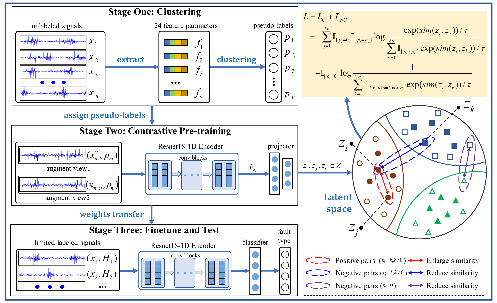

# CLCO: Domain Invariant Feature Learning Based on Cluster Contrastive Learning for Intelligence Fault Diagnosis with Limited Labeled Data

The pytorch implementation for CLCO: Domain Invariant Feature Learning Based on Cluster Contrastive Learning for Intelligence Fault Diagnosis with Limited Labeled Data, [[repo](https://github.com/kabu2i/CLCO)], [[pdf](https://ieeexplore.ieee.org/document/10328714)].



#### Installation

```
$ pip install -r requirements.txt
$ python run_main.py
```

You can change the running configurations by editing the parameter in `run_main.py` file.

#### Dataset

Used dataset and their source:

* Case Western Reserve University Bearing Data, [link](https://engineering.case.edu/bearingdatacenter).
* Paderborn University KAt Data Center, [link](https://mb.uni-paderborn.de/en/kat/main-research/datacenter/bearing-datacenter/data-sets-and-download).

Directory structure of the data:

```
.
├── CWRU
│   ├── Drive End 12k
│   ├── Drive End 48k
│   ├── Fan End 12k
│   └── Normal
├── CWRU_10_classes
│   ├── 0HP
│   ├── 1HP
│   ├── 2HP
│   └── 3HP
└── PU bearing dataset
    ├── K001
    ├── K002
    ├── K003
    └── ...

```
